[logo]: ./images/Dykc8zL.png "Logo"
[brain src]: ./images/SxaK0oh.jpg "Brain Source"
[brain]: ./images/gjB3z0n.jpg "Brain"
[doge with it src]: ./images/CTVes2t.png "Doge With It Source"
[doge with it]: ./images/b4hoaDi.jpg "Doge With It"
[statue of liberty src]: ./images/QdsRE66.jpg "Statur of Liberty Source"
[statue of liberty]: ./images/7sHz9Y7.jpg "Statue of Liberty"
[cell src]: ./images/OfXEvDD.png "Cell Source"
[cell]: ./images/HjcW0lV.jpg "Cell"
[waterfall src]: ./images/WgAvyDa.jpg "Waterfall Source"
[waterfall]: ./images/QJcVYZs.jpg "Waterfall"
[ping pong src]: ./images/cqmInhJ.jpg "Ping Pong Source"
[ping pong]: ./images/NrXhtoG.jpg "Ping Pong"
[skyline src]: ./images/WAzEeIi.jpg "Skyline Source"
[skyline]: ./images/AY2SQla.jpg "Skyline"
[many doge]: ./images/xu9IuLN.jpg "Many Doge"
[samples]: ./images/cKBGzUo.jpg "Samples"
[size reference]: ./images/WiZprvx.jpg "Size Reference"

![logo][logo]

An Android application where you can create 3D models of a picture and even 3D print it!

Available printing materials range from colored plastics, wax, stainless steel, gold, silver, brass,
bronze, platinum, aluminum, and many more!

Take pictures of your friends, family or pets and have them Carbonized!

[How to be a Magician with Shapeways APIs (Guide)](https://medium.com/shapeways-tech/how-to-be-a-magician-with-shapeways-apis-f255d99e3c4b)

Have a look at the [Shapeways Carbonizr Shop](https://www.shapeways.com/shops/carbonizr "Carbonizr Shop") for ideas, prints, and creations!

<h2>Miniature Landmarks</h2>

<table>
  <tr>
    <th width="50%">Source</th>
    <th width="50%">3D Model</th>
  </tr>
  <tr>
    <td>
      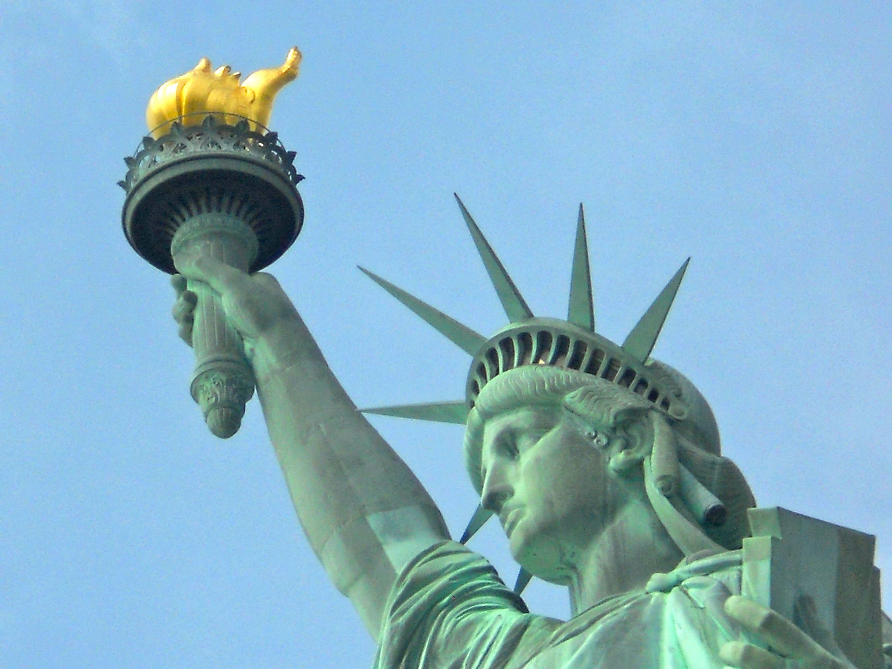
    </td>
    <td>
      <a href="https://www.shapeways.com/product/33JYZLNNE/statue-of-liberty?optionId=59785296">
        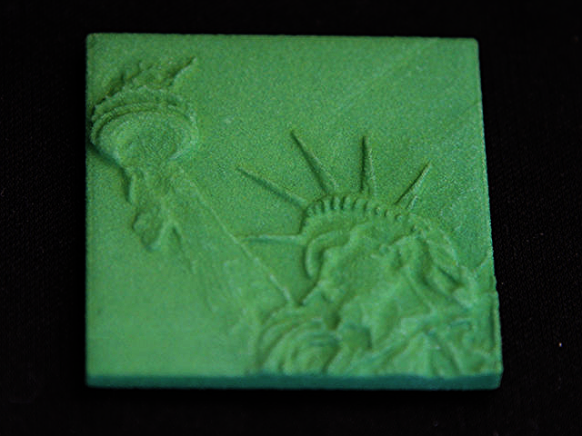
      </a>
    </td>
  </tr>
  <tr>
    <td>
      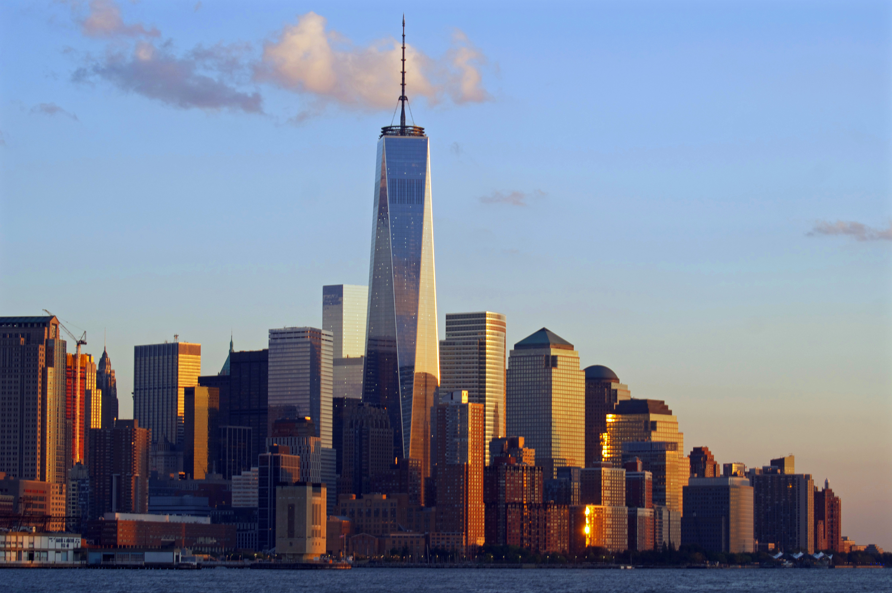
    </td>
    <td>
      <a href="https://www.shapeways.com/product/A2MK49G6W/manhattan-skyline?optionId=59785191">
        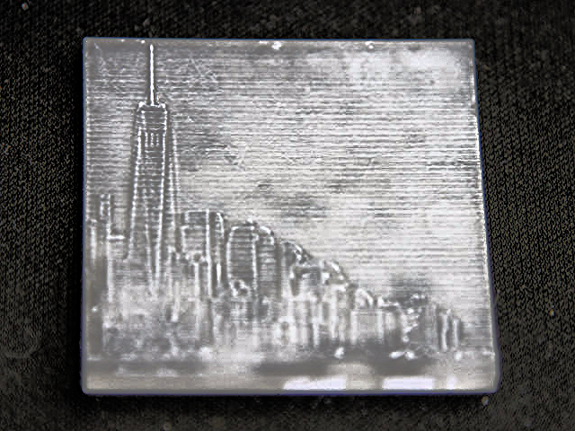
      </a>
    </td>
  </tr>
</table>

<h2>Educational Frames</h2>

<table>
  <tr>
    <th width="50%">Source</th>
    <th width="50%">3D Model</th>
  </tr>
  <tr>
    <td>
      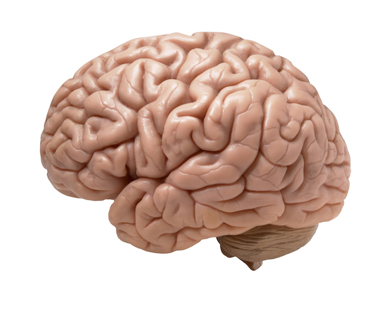
    </td>
    <td>
      <a href="https://www.shapeways.com/product/BZTTT2A28/brain?optionId=59785142">
        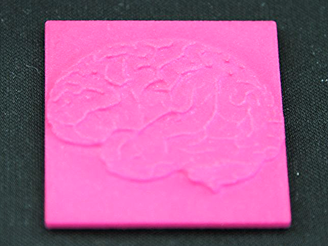
      </a>
    </td>
  </tr>
  <tr>
    <td>
      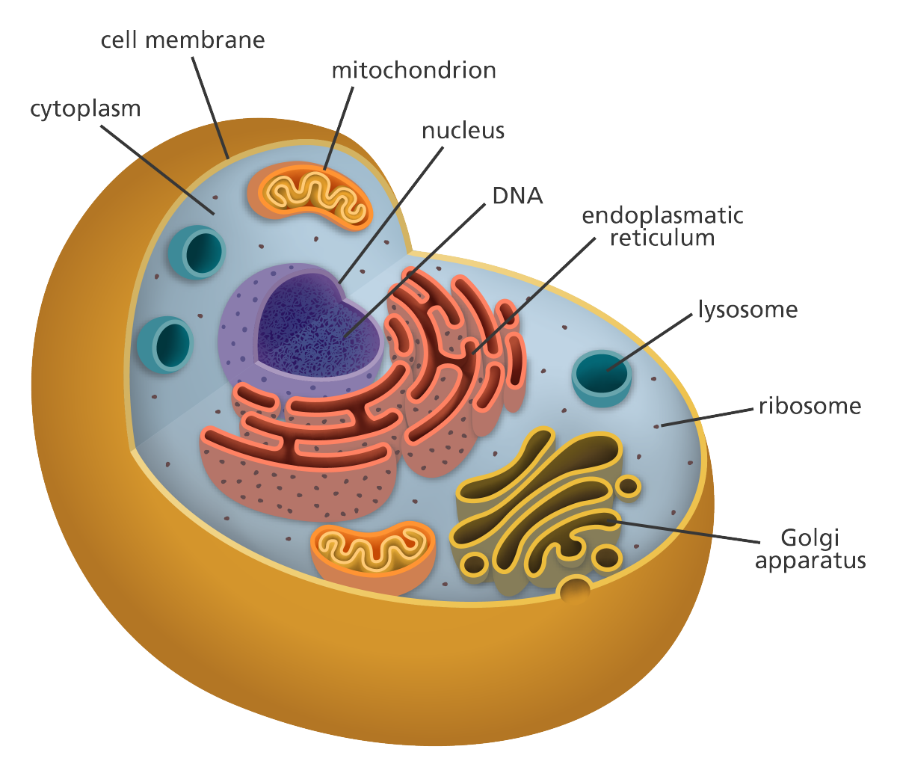
    </td>
    <td>
      <a href="https://www.shapeways.com/product/AX2J57QS2/cell?optionId=59785090">
        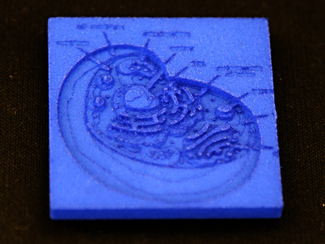
      </a>
    </td>
  </tr>
</table>

<h2>Scenic Frames</h2>

<table>
  <tr>
    <th width="50%">Source</th>
    <th width="50%">3D Model</th>
  </tr>
  <tr>
    <td>
      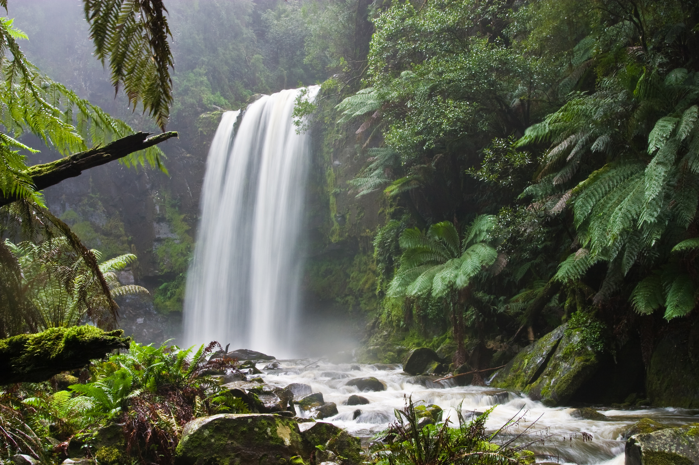
    </td>
    <td>
      <a href="https://www.shapeways.com/product/7MLGPYJLQ/hopetoun-waterfall?optionId=59785347">
        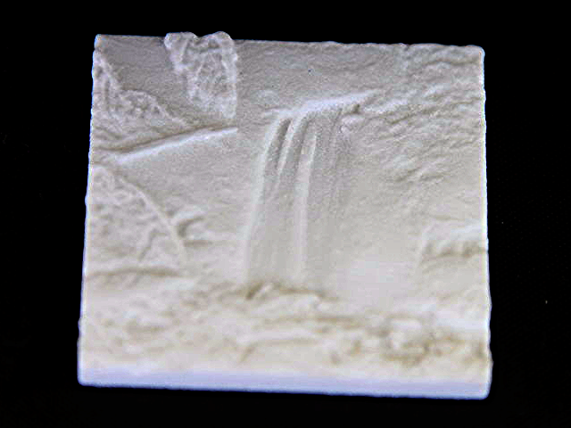
      </a>
    </td>
  </tr>
</table>

<h2>Action Shots</h2>

<table>
  <tr>
    <th width="50%">Source</th>
    <th width="50%">3D Model</th>
  </tr>
  <tr>
    <td>
      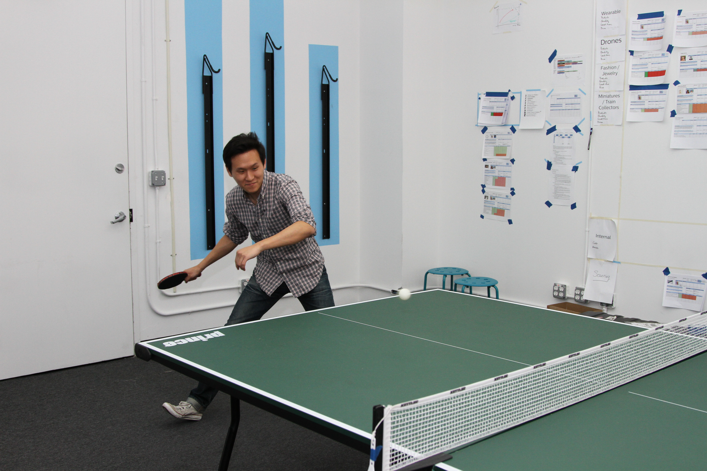
    </td>
    <td>
      <a href="https://www.shapeways.com/product/BM2JK6YPC/ping-pong?optionId=59785482">
        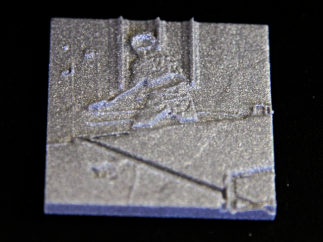
      </a>
    </td>
  </tr>
</table>

<h2>Memes</h2>

<table>
  <tr>
    <th width="50%">Source</th>
    <th width="50%">3D Model</th>
  </tr>
  <tr>
    <td>
      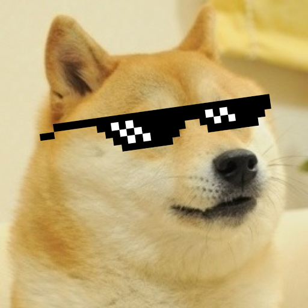
    </td>
    <td>
      <a href="https://www.shapeways.com/product/XTGSMS82C/doge-with-it?optionId=59785033">
        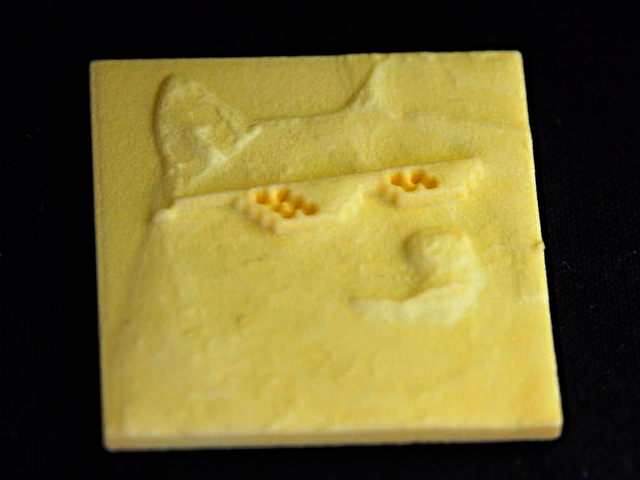
      </a>
    </td>
  </tr>
</table>

## ... And the rest to your imagination
Powered by [Shapeways](http://www.shapeways.com/ "Shapeways") and [LibGDX](https://github.com/libgdx/libgdx "LibGDX").

Want to create your own 3D-printing app? Here's their [Getting Started](http://developers.shapeways.com/) page!

Curious what the server looks like? [3D Image Conversion Server](https://github.com/IgorGee/3D-Image-Conversion-Server).

## Scale Comparison

![samples]
![size reference]
